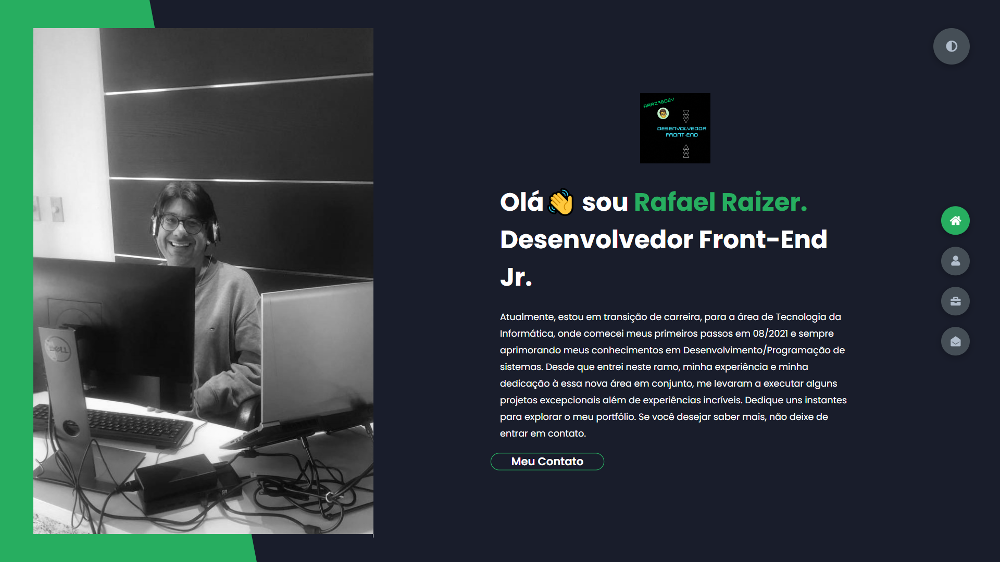

***

 

 

  

***
#  Venho aqui apresentar

# My new Portfolio
   
 
   
---
# 

   
#  

### [Clique aqui para acessar o Projeto](https://https://portifolio-rafarz76dev.netlify.app/)

 
***
  
   
---

   
# Suas aplicações:

 
 
 
 
 ---
#  Ferramenta Do Desafio⁉

---
##  &nbsp;Linguagem Tecnológica do Desafio:

   
  
 ---
# Passo a Passo do Projeto:
  
 ###  Sites `Referência` do Projeto : 
   
- [`Fonte do Google`](https://fonts.googleapis.com/css2?family=Poppins:wght@400;500;600;700;800&display=swap)   

- [`Icones-W3schools`](https://www.w3schools.com/icons/fontawesome5_icons_security.asp)

- [`Formulário-formspree`](https://formspree.io/)  Para endereço de e-mail, foi adicionado o atributo replyto (isso significa apenas que você poderá responder rapidamente ao usuário que enviou originalmente por e-mail).
   
- [`AutoComplete-W3schools`](3schools.com/tags/att_input_autocomplete.asp)  É um atributo que especifica  um campo de entrada se deve ou não ter o preenchimento automático ativado.
 
###  O projeto teve a criação do Html acrescentando:
- `links, imagens, blocos de texto com div, # para os menus, por section, containers...`

###  Obteve as estilizações em `css`e `scss`com algumas propriedades: 
- `Elementos, textos, dimensões, alinhamentos, sombreamentos, transformação, transição, animação...` deixando assim o site mais elegante.  
  
 ###  Foi consumido nesse projeto o @media conhecido como media-query que com a condição de especificar:
 - `Um equipamento, tamanho, resolução, formato, rotação, etc.`   
  

   
   
